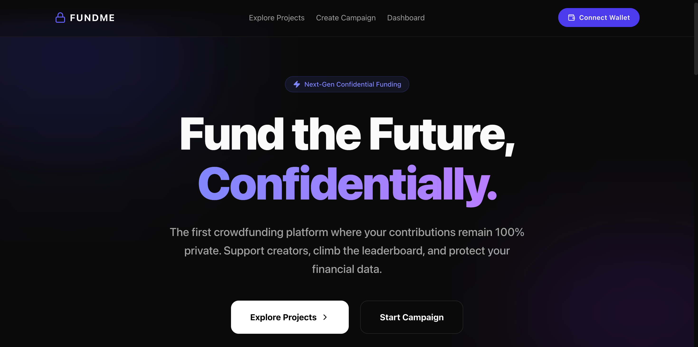
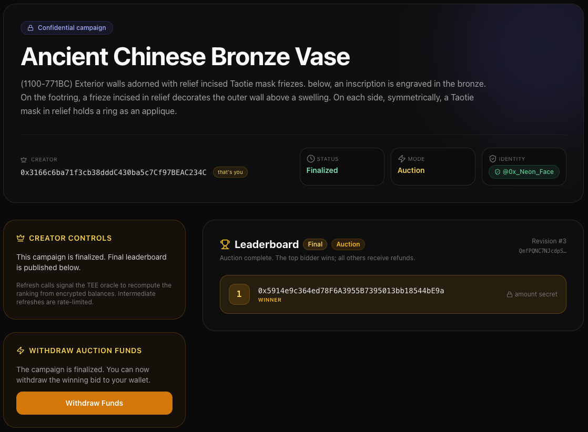
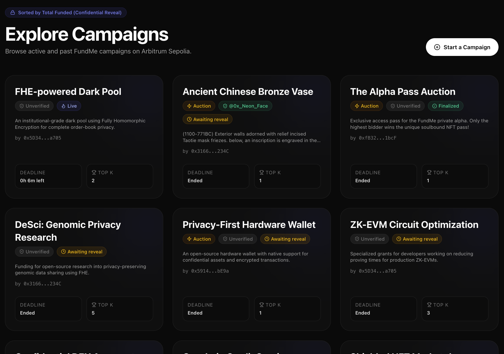
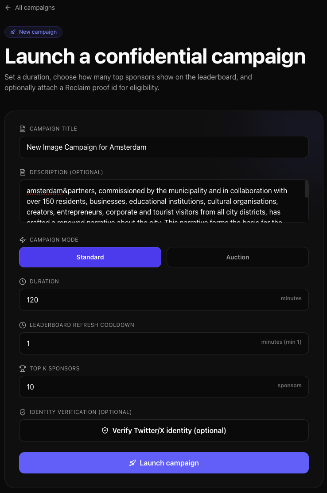
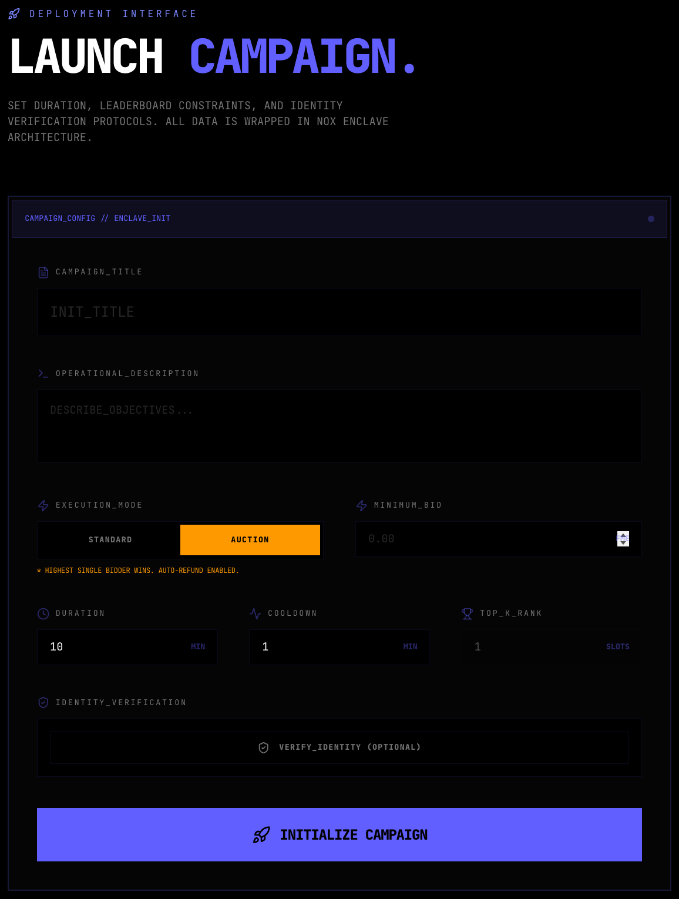
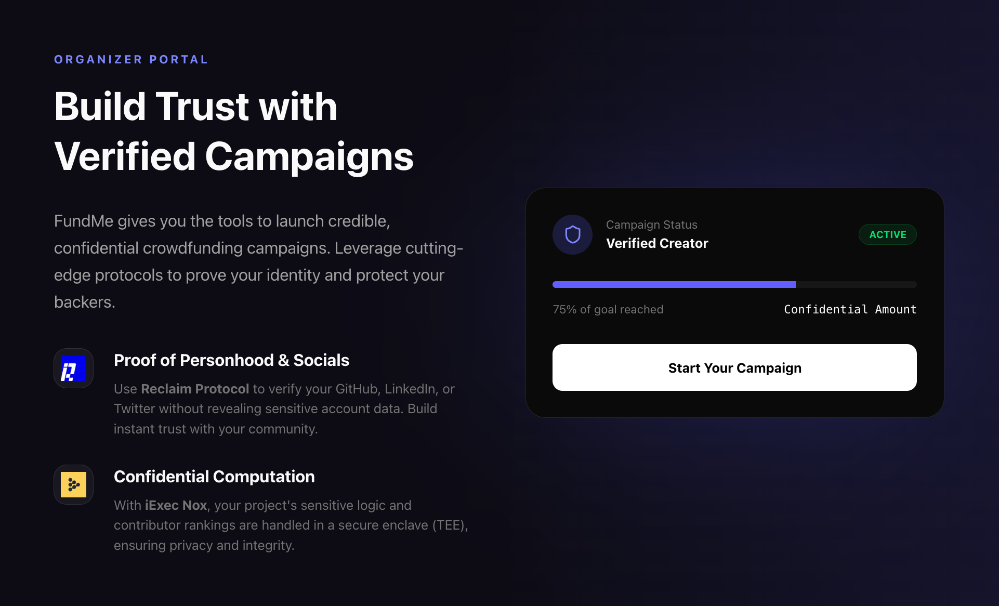
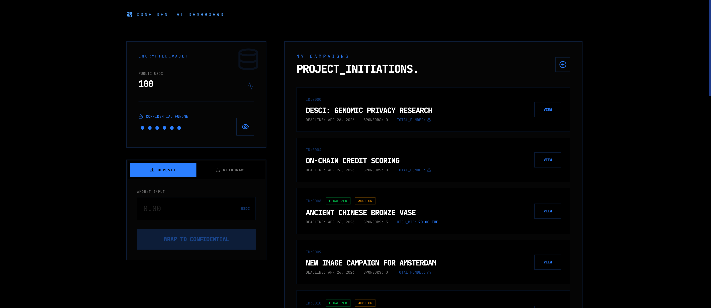

# FUNDME — Confidential Crowdfunding on Blockchain

> The first crowdfunding platform where your contributions remain 100% private. Support creators, climb the leaderboard, and protect your financial data.



---

## Overview

FUNDME is a confidential crowdfunding platform built on **Arbitrum Sepolia**. Contribution amounts are encrypted on-chain using [iExec NOX](https://docs.iex.ec/) (Fully Homomorphic Encryption), so no one — not even the contract — can see how much you contributed. Rankings are computed off-chain inside a **Trusted Execution Environment (TEE)** oracle, then published to IPFS for permanent, verifiable history.

**[Try it live →](https://fundme-2026.vercel.app/)**

**Two campaign modes:**
- **Standard** — Top-K sponsors win; creator collects their pooled contributions.
- **Auction** — Highest single bidder wins; all others receive automatic refunds.

---

## Architecture

```
┌──────────────┐     sponsor / create       ┌──────────────────────┐
│   Web App    │ ──────────────────────── ▶ │  FundMePlatform.sol  │
│  (Next.js)   │ ◀ ───────────────────────  │  FundMeToken.sol     │
└──────────────┘     read state / events    │  (Arbitrum Sepolia)  │
                                            └──────────┬───────────┘
                                                       │ RevealRequested event
                                            ┌──────────▼───────────┐
                                            │   TEE Oracle (NOX)   │
                                            │  decrypt → rank →    │
                                            │  pin IPFS → fulfill  │
                                            └──────────────────────┘
```

| Layer | Stack |
|---|---|
| Smart Contracts | Solidity 0.8.28 · Hardhat · OpenZeppelin · iExec NOX (ERC-7984) |
| Oracle | Node.js · TypeScript · Viem · iExec NOX Handle Client · Pinata IPFS |
| Frontend | Next.js 16 · React 19 · Wagmi v2 · RainbowKit v2 · Tailwind CSS v4 · Framer Motion |
| Identity | Reclaim Protocol (Twitter/X proof) |

---

## Features

### Confidential Contributions
Sponsor amounts are encrypted with FHE before hitting the chain. Only the TEE oracle can decrypt them — contribution sizes are never exposed publicly.

### Live Leaderboards via TEE


Creators can request a leaderboard refresh at any time (subject to a configurable cooldown). The oracle decrypts all contributions inside a secure enclave, ranks sponsors, and pins the result to IPFS. Intermediate snapshots build an immutable revision history.

### Explore & Browse Campaigns


Browse all active and finalized campaigns on Arbitrum Sepolia. Each card shows campaign mode, top-K slots, deadline, and current reveal status.

### Launch a Campaign



Configure your campaign:
- **Title & description**
- **Mode** — Standard (top-K) or Auction (winner-takes-all)
- **Minimum bid** (auction mode only)
- **Duration** (minutes)
- **Leaderboard refresh cooldown** (min 1 minute)
- **Top-K sponsors**
- **Optional Twitter/X identity verification** via Reclaim Protocol

### Verified Creator Identity


Use Reclaim Protocol zero-knowledge proofs to verify your Twitter/X account without exposing credentials. Verified creators display a badge, building trust with backers.

### Dashboard


Track your active campaigns and sponsored projects in one place. Wrap/unwrap USDC to confidential FUNDME tokens and monitor deadlines and reveal status.

---

## Deployed Contracts (Arbitrum Sepolia)

| Contract | Address |
|---|---|
| `FundMePlatform` | `0xD74cC75D381d607f49Bb0D647f8f719E185EeF3A` |
| `FundMeToken` | `0x6D15F83cbCcCF396CB84E21805d54473864a67B9` |
| `USDC (testnet)` | `0x75faf114eafb1BDbe2F0316DF893fd58CE46AA4d` |

---

## Prerequisites

Before you begin, make sure you have the following installed and set up:

- **Node.js 20+** — [nodejs.org](https://nodejs.org)
- **Git**
- **A browser wallet** (MetaMask or any WalletConnect-compatible wallet)
- **Arbitrum Sepolia testnet ETH** — bridge from [bridge.arbitrum.io](https://bridge.arbitrum.io) or use a faucet
- **Testnet USDC** — mint from the [Circle faucet](https://faucet.circle.com/) on Arbitrum Sepolia

---

## Required Credentials

You need accounts and API keys from **three** external services. Obtain these before setting up any component.

### 1. Alchemy (RPC Provider)
Used by the blockchain deployer and the oracle to read/write the Arbitrum Sepolia chain.

1. Sign up at [alchemy.com](https://www.alchemy.com/)
2. Create a new app → select **Arbitrum Sepolia**
3. Copy the **HTTPS endpoint** (looks like `https://arb-sepolia.g.alchemy.com/v2/<API_KEY>`)
4. Used in: `blockchain/.env` → `ARBITRUM_SEPOLIA_RPC_URL`, `oracle/.env` → `RPC_URL`

> You can also use the public endpoint `https://sepolia-rollup.arbitrum.io/rpc` for testing, but a dedicated key is more reliable.

### 2. Pinata (IPFS Pinning)
Used by the oracle to publish leaderboard snapshots to IPFS.

1. Sign up at [pinata.cloud](https://www.pinata.cloud/)
2. Go to **API Keys** → create a new key with **pinFileToIPFS** and **pinJSONToIPFS** permissions
3. Copy the **JWT** token
4. Used in: `oracle/.env` → `PINATA_JWT`

### 3. Reclaim Protocol (Identity Verification — optional but recommended)
Used by the web app to let campaign creators verify their Twitter/X account via ZK proof.

1. Sign up at [dev.reclaimprotocol.org](https://dev.reclaimprotocol.org/)
2. Create a new application
3. Add the **Twitter/X follower count** provider (or any Twitter provider)
4. Copy the **App ID**, **App Secret**, and **Provider ID**
5. Used in: `web-app/.env` → `NEXT_PUBLIC_RECLAIM_APP_ID`, `NEXT_PUBLIC_RECLAIM_APP_SECRET`, `NEXT_PUBLIC_RECLAIM_PROVIDER_ID`

> **Security note:** The Reclaim App Secret should never be exposed in production. Move any server-side secret handling to a Next.js API route or separate backend before deploying publicly.

### 4. Arbiscan API Key (optional — for contract verification)
1. Sign up at [arbiscan.io](https://arbiscan.io/) → **API Keys** → create a key
2. Used in: `blockchain/.env` → `ARBISCAN_API_KEY`

### 5. Deployer & Oracle Wallets (private keys)
You need two funded Arbitrum Sepolia wallets:

| Wallet | Purpose | Needs |
|---|---|---|
| **Deployer** | Deploy and manage contracts | Testnet ETH for gas |
| **Oracle** | Call `fulfillLeaderboard()` on-chain | Testnet ETH for gas |

Export the private key from MetaMask (Account Details → Export Private Key) for each. Never use mainnet keys.

---

## Installation & Setup

Clone the repository:

```bash
git clone <repo-url>
cd FUNDME
```

### 1. Blockchain (Smart Contracts)

```bash
cd blockchain
npm install
cp .env.example .env
```

Edit `blockchain/.env`:

```env
# Private key of the deployer wallet (with 0x prefix)
PRIVATE_KEY_DEPLOYER=0x...

# Arbitrum Sepolia RPC endpoint
ARBITRUM_SEPOLIA_RPC_URL=https://arb-sepolia.g.alchemy.com/v2/<YOUR_KEY>

# Arbiscan API key for contract verification (optional)
ARBISCAN_API_KEY=
```

**Compile contracts:**

```bash
npx hardhat compile
```

**Run tests:**

```bash
npx hardhat test
```

**Deploy to Arbitrum Sepolia:**

```bash
npx hardhat ignition deploy ignition/modules/FundMe.ts --network arbitrumSepolia
```

After deployment, note the printed contract addresses — you will need them for the oracle and web app.

**Verify contracts on Arbiscan (optional):**

```bash
npx hardhat verify --network arbitrumSepolia <CONTRACT_ADDRESS> <CONSTRUCTOR_ARGS>
```

---

### 2. Oracle (TEE Leaderboard Service)

```bash
cd oracle
npm install
cp .env.example .env
```

Edit `oracle/.env`:

```env
# Private key of the oracle wallet (signs fulfillLeaderboard transactions)
PRIVATE_KEY_ORACLE=0x...

# Arbitrum Sepolia RPC endpoint
RPC_URL=https://arb-sepolia.g.alchemy.com/v2/<YOUR_KEY>

# Pinata JWT for IPFS pinning
PINATA_JWT=<YOUR_PINATA_JWT>

# How many blocks back to replay missed RevealRequested events on startup
# Set to 0 to disable catchup (default: 200000)
STARTUP_LOOKBACK_BLOCKS=200000
```

**Start the oracle:**

```bash
npm start
```

The oracle will:
1. Replay any `RevealRequested` events it may have missed (based on `STARTUP_LOOKBACK_BLOCKS`)
2. Subscribe to new `RevealRequested` events in real time
3. For each event: decrypt contributions in TEE, rank sponsors, pin JSON to IPFS, and call `fulfillLeaderboard()` on-chain

Keep the oracle running as long as you want leaderboard reveals to work. For production, run it as a background service (e.g., `pm2`, Docker, or a cloud VM).

---

### 3. Web App (Frontend)

```bash
cd web-app
npm install
cp .env.example .env
```

Edit `web-app/.env`:

```env
# Reclaim Protocol credentials for Twitter/X identity verification
NEXT_PUBLIC_RECLAIM_APP_ID=<YOUR_APP_ID>
NEXT_PUBLIC_RECLAIM_APP_SECRET=<YOUR_APP_SECRET>
NEXT_PUBLIC_RECLAIM_PROVIDER_ID=<YOUR_PROVIDER_ID>

# Contract addresses — leave blank to use the defaults hardcoded in src/lib/contracts.ts
NEXT_PUBLIC_FUNDME_PLATFORM_ADDRESS=
NEXT_PUBLIC_FUNDME_TOKEN_ADDRESS=
```

> If you deployed your own contracts, fill in `NEXT_PUBLIC_FUNDME_PLATFORM_ADDRESS` and `NEXT_PUBLIC_FUNDME_TOKEN_ADDRESS` with the addresses from Step 1.

**Run the development server:**

```bash
npm run dev
```

Open [http://localhost:3000](http://localhost:3000) in your browser.

**Build for production:**

```bash
npm run build
npm start
```

---

## Usage Guide

### For Sponsors

1. **Connect wallet** — click "Connect" in the top-right corner and select your wallet (MetaMask, WalletConnect, etc.)
2. **Switch to Arbitrum Sepolia** — your wallet will be prompted to add and switch to the network
3. **Get testnet USDC** — mint from [faucet.circle.com](https://faucet.circle.com/) on Arbitrum Sepolia
4. **Wrap USDC** — go to Dashboard → wrap USDC into confidential `FUNDME` tokens
5. **Approve the platform** — set `FundMePlatform` as an operator on your `FundMeToken` balance
6. **Browse campaigns** — go to Explore and find a campaign to support
7. **Contribute** — enter an amount; it is encrypted before the transaction is sent

### For Campaign Creators

1. Connect your wallet and wrap USDC (same as above)
2. Click **"Create Campaign"** and fill in:
   - Title and description
   - Mode: **Standard** (top-K winners) or **Auction** (single highest bidder)
   - Duration, cooldown interval, and top-K count
   - (Optional) Verify your Twitter/X identity with Reclaim Protocol
3. Once the campaign is live, share the URL with your audience
4. **Request a leaderboard reveal** from your campaign page — the oracle will decrypt and rank contributions
5. After the deadline: call **"Set Top-K Sponsors"** to lock winners, then **"Withdraw Funds"**

### For Non-Winners (Refunds)

After the deadline and top-K sponsors are set, non-winners can visit the campaign page and call **"Claim Refund"** to recover their wrapped tokens.

---

## How It Works

1. **Sponsor wraps USDC** into encrypted `FundMeToken` and sets `FundMePlatform` as operator.
2. **Sponsor calls `sponsorProject()`** with an encrypted contribution amount. The contract stores an FHE handle; the oracle is granted ACL access to decrypt it.
3. **Creator (or sponsor) calls `requestReveal()`** — a `RevealRequested` event is emitted on-chain.
4. **Oracle picks up the event**, decrypts all contributions in TEE, ranks by amount (block-number tiebreaker), pins JSON to IPFS, and calls `fulfillLeaderboard()` on-chain.
5. **After the deadline**, `setTopKSponsors()` is called, locking winners. Creator calls `withdrawProjectFunds()`; non-winners call `claimRefund()`.

---

## Privacy Model

| What | Visible |
|---|---|
| Contribution amounts | Never — encrypted with FHE |
| Sponsor addresses (winners) | Yes — required for fund distribution |
| Sponsor addresses (non-winners) | Pseudonymous — only exposed if they claim a refund |
| Leaderboard rankings | Public after each reveal (IPFS) |
| IPFS leaderboard history | Permanent and immutable |

---

## Project Structure

```
FUNDME/
├── blockchain/          # Solidity contracts + Hardhat config + deployment scripts
│   ├── contracts/
│   │   ├── FundMePlatform.sol
│   │   └── FundMeToken.sol
│   ├── ignition/modules/FundMe.ts
│   └── .env.example
├── oracle/              # TEE oracle service
│   ├── src/index.ts
│   └── .env.example
└── web-app/             # Next.js frontend
    ├── src/
    │   ├── app/
    │   └── components/
    └── .env.example
```

---

## Troubleshooting

**Oracle not picking up events**
- Make sure `PRIVATE_KEY_ORACLE` and `RPC_URL` are set correctly in `oracle/.env`
- Check that the oracle wallet has enough testnet ETH to pay for `fulfillLeaderboard()` transactions
- Increase `STARTUP_LOOKBACK_BLOCKS` to replay further back in history

**Transactions failing in the web app**
- Confirm your wallet is on **Arbitrum Sepolia** (chain ID 421614)
- Make sure you have wrapped USDC and set the platform as operator before sponsoring
- Check the browser console for revert reasons

**IPFS pin failing**
- Verify `PINATA_JWT` is valid and has pinning permissions
- Check your Pinata account's usage limit

---

## License

MIT
